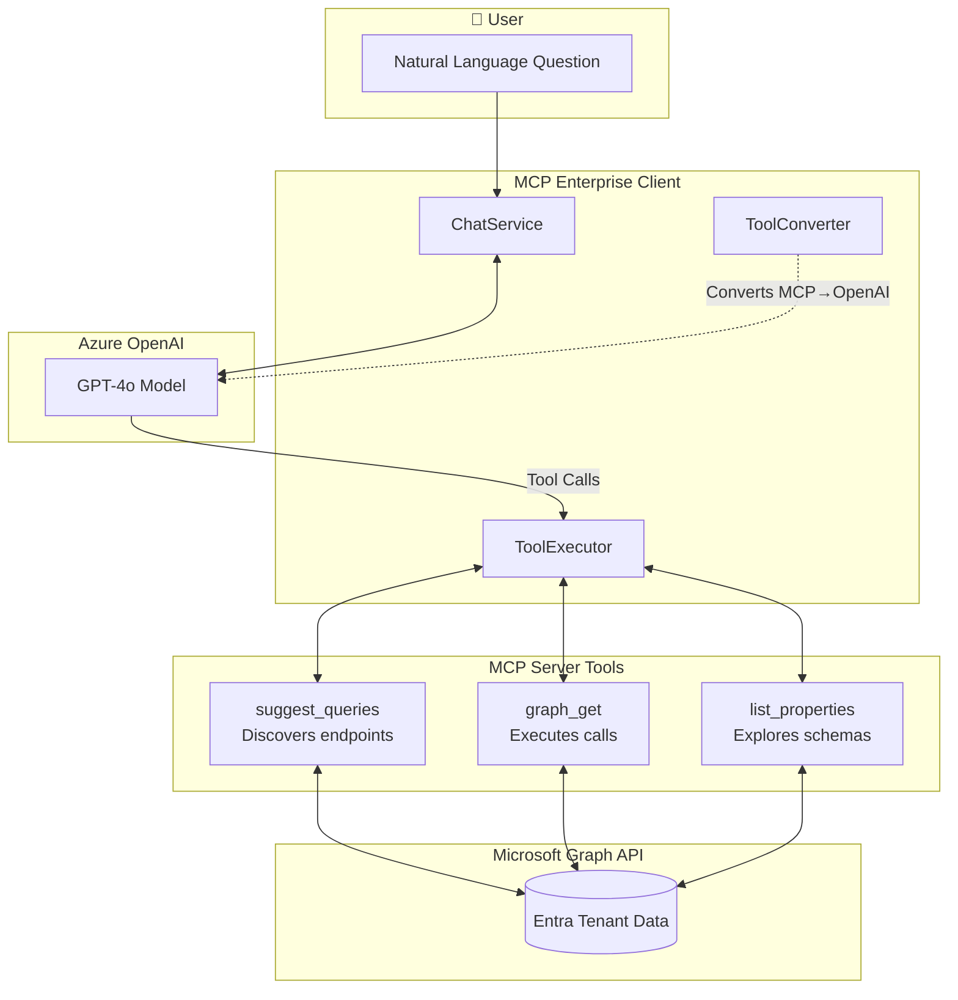

# MCP Enterprise Client

A .NET 8 console application that connects to Microsoft's Model Context Protocol (MCP) Server for Enterprise, enabling AI-powered natural language queries against your Microsoft Entra tenant data using Microsoft Graph API.

## Table of Contents

- [Overview](#overview)
- [Features](#features)
- [Architecture](#architecture)
- [Project Structure](#project-structure)
- [Prerequisites](#prerequisites)
- [Installation](#installation)
- [Configuration](#configuration)
- [Running the Application](#running-the-application)
- [Example Queries](#example-queries)
- [Testing](#testing)
- [Troubleshooting](#troubleshooting)
- [Contributing](#contributing)

## Overview

This client application demonstrates how to:
- Connect to Microsoft's MCP Server using SSE (Server-Sent Events) transport
- Authenticate using Azure AD with multiple credential options
- Integrate Azure OpenAI's GPT-4o model for natural language understanding
- Execute Microsoft Graph API queries through AI-orchestrated tool calling

## Features

- ✅ **Natural Language Queries**: Ask questions in plain English about your tenant data
- ✅ **AI-Powered Tool Orchestration**: GPT-4o automatically selects and calls the right MCP tools
- ✅ **Multiple Authentication Methods**: Client secret, certificate, managed identity, or interactive login
- ✅ **Token Caching**: Persistent token cache avoids repeated logins
- ✅ **Key Vault Integration**: Optional Azure Key Vault for secure secret management
- ✅ **Modular Architecture**: Clean separation of concerns for maintainability

## Architecture



### Component Flow

1. **User** enters a question in natural language
2. **ChatService** sends the question to Azure OpenAI with available tools
3. **Azure OpenAI** decides which MCP tools to call and with what parameters
4. **ToolExecutor** invokes the MCP tools through the SSE transport
5. **MCP Server** executes Microsoft Graph API calls on your behalf
6. **Results** flow back through the chain to be presented in natural language

## Project Structure

```
MCP Client/
├── MCP Client.sln              # Solution file
├── docs/                       # Documentation
│   ├── README.md               # This file
│   ├── AUTH_FLOW.md            # Detailed authentication documentation
│   └── BLOG_POST.md            # Technical blog post
├── src/                        # Source code
│   ├── McpEnterpriseClient.csproj
│   ├── appsettings.json        # Configuration file
│   ├── Program.cs              # Application entry point
│   ├── Authentication/         # Azure AD authentication
│   │   ├── AuthenticationService.cs
│   │   └── TokenCacheHelper.cs
│   ├── Chat/                   # OpenAI chat integration
│   │   ├── ChatService.cs
│   │   ├── ToolConverter.cs
│   │   └── ToolExecutor.cs
│   ├── Configuration/          # Configuration loading
│   │   ├── AppSettings.cs
│   │   └── ConfigurationLoader.cs
│   ├── Mcp/                    # MCP client connection
│   │   └── McpClientService.cs
│   └── Utilities/              # Helper classes
│       ├── CertificateHelper.cs
│       └── ErrorHandler.cs
└── test/                       # Unit tests
    └── McpEnterpriseClient.Tests/
        ├── Authentication/
        ├── Chat/
        ├── Configuration/
        ├── Integration/
        └── Utilities/
```

## Prerequisites

- [.NET 8.0 SDK](https://dotnet.microsoft.com/download/dotnet/8.0) or later
- Azure subscription with:
  - Azure OpenAI resource with `gpt-4o` model deployed
  - Azure AD app registration with Microsoft Graph permissions
- Microsoft Entra tenant (for querying data)

## Installation

1. **Clone the repository**:
   ```bash
   git clone https://github.com/ravindrabhartiya/MCPGraphClient.git
   cd "MCP Client"
   ```

2. **Restore dependencies**:
   ```bash
   dotnet restore
   ```

3. **Build the solution**:
   ```bash
   dotnet build
   ```

## Configuration

### Azure AD App Registration

1. Go to [Azure Portal](https://portal.azure.com) → **Azure Active Directory** → **App registrations**
2. Click **New registration**
   - Name: `MCP Enterprise Client`
   - Supported account types: **Single tenant**
3. Configure **API Permissions**:
   - Click **Add a permission** → **Microsoft Graph** → **Application permissions**
   - Add: `User.Read.All`, `Directory.Read.All`, `Group.Read.All`
   - **Grant admin consent** (required!)
4. Create credentials (choose one):
   - **Client Secret**: Certificates & secrets → New client secret
   - **Certificate**: Upload a certificate for production environments

### Configuration Options

The application supports multiple configuration sources (in priority order):

| Source | Use Case |
|--------|----------|
| `appsettings.json` | Default configuration file |
| Environment variables | CI/CD and container deployments |
| Azure Key Vault | Production secret management |

#### Using appsettings.json

Edit `src/appsettings.json`:

```json
{
  "AzureAD": {
    "TenantId": "YOUR-TENANT-ID",
    "ClientId": "YOUR-CLIENT-ID",
    "ClientSecret": "YOUR-CLIENT-SECRET"
  },
  "AzureOpenAI": {
    "Endpoint": "https://YOUR-RESOURCE.openai.azure.com",
    "DeploymentName": "gpt-4o",
    "ApiKey": "YOUR-API-KEY"
  },
  "McpServer": {
    "Endpoint": "https://mcp.svc.cloud.microsoft/enterprise"
  }
}
```

#### Using Environment Variables

```powershell
# PowerShell
$env:AZURE_TENANT_ID = "your-tenant-id"
$env:AZURE_CLIENT_ID = "your-client-id"
$env:AZURE_CLIENT_SECRET = "your-secret"
$env:AZURE_OPENAI_ENDPOINT = "https://your-resource.openai.azure.com"
$env:AZURE_OPENAI_API_KEY = "your-api-key"
```

```bash
# Bash
export AZURE_TENANT_ID="your-tenant-id"
export AZURE_CLIENT_ID="your-client-id"
export AZURE_CLIENT_SECRET="your-secret"
export AZURE_OPENAI_ENDPOINT="https://your-resource.openai.azure.com"
export AZURE_OPENAI_API_KEY="your-api-key"
```

#### Using Azure Key Vault

Set the Key Vault URI in config or environment:

```json
{
  "KeyVault": {
    "Uri": "https://your-keyvault.vault.azure.net"
  }
}
```

The application will automatically load secrets from Key Vault using `DefaultAzureCredential`.

## Running the Application

```bash
cd src
dotnet run
```

Or from the solution root:

```bash
dotnet run --project src/McpEnterpriseClient.csproj
```

## Example Queries

Once connected, you can ask questions like:

| Query | What it does |
|-------|--------------|
| "How many users are in my tenant?" | Counts all users |
| "List all guest users" | Filters external users |
| "Show me users who didn't sign in last month" | Analyzes sign-in activity |
| "Is MFA enabled for all administrators?" | Checks security configuration |
| "What groups does user@domain.com belong to?" | Lists group memberships |

The AI automatically:
1. Calls `microsoft_graph_suggest_queries` to find the right Graph API endpoint
2. Calls `microsoft_graph_get` to execute the query
3. Presents results in natural language

## Testing

Run all tests:

```bash
dotnet test
```

Run with coverage:

```bash
dotnet test --collect:"XPlat Code Coverage"
```

### Test Categories

| Category | Description |
|----------|-------------|
| `Configuration` | Tests for AppSettings and ConfigurationLoader |
| `Chat` | Tests for ToolConverter and tool conversion |
| `Utilities` | Tests for ErrorHandler and CertificateHelper |
| `Integration` | End-to-end configuration loading tests |

## Troubleshooting

### "No scopes found in user token"

**Cause**: Missing Microsoft Graph permissions or admin consent.

**Solution**:
1. Go to Azure Portal → App registrations → Your app
2. API permissions → Add `User.Read.All`, `Directory.Read.All`
3. Click **Grant admin consent**
4. Wait 5-10 minutes for propagation

### "401 Unauthorized"

**Cause**: Invalid or expired credentials.

**Solution**:
- Check client secret hasn't expired
- Verify tenant ID is correct
- Ensure app registration exists

### "405 Method Not Allowed"

**Cause**: SSE transport issue.

**Solution**:
- Verify MCP server endpoint is correct
- Check network connectivity to `mcp.svc.cloud.microsoft`

### Token Cache Issues

To clear the cached token:

```powershell
Remove-Item "$env:LOCALAPPDATA\McpEnterpriseClient\msal_token_cache.bin"
```

## Contributing

1. Fork the repository
2. Create a feature branch: `git checkout -b feature/my-feature`
3. Commit changes: `git commit -am 'Add my feature'`
4. Push to branch: `git push origin feature/my-feature`
5. Submit a pull request

## License

This project is licensed under the MIT License.
